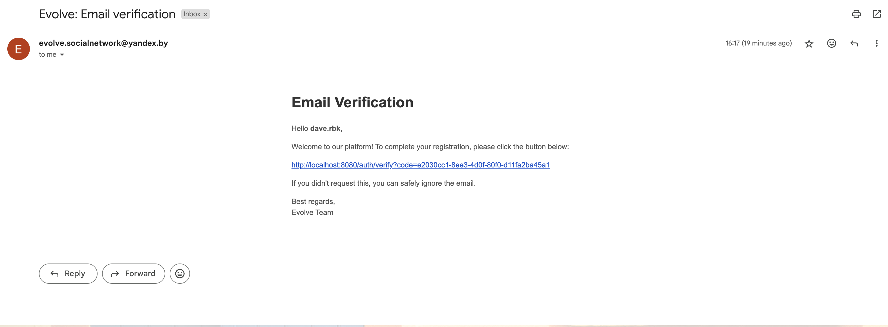

# Evolve

## Description

Evolve was thought to be a network for individuals aimed at self-development and positive 
improvements fostering. As we ran out of efforts to make it complete, it was decided to leave it
here just to showcase backend of the project.

## Getting Started Locally

### Prerequisites

- Java 17 or higher
- Maven 3.9.6 or higher
- Docker daemon running

### Local Setup

1. Clone the repository
```bash
git clone https://github.com/daverbk/evolve.git
```

2. Switch to the backend project directory
```bash
cd evolve/backend
```

3. Build the project
```bash
mvn clean install
```

4. Run the project
```bash
mvn spring-boot:run
```

## Entities diagram


## Usage

1. User has to first sign up and receive a confirmation email
2. User has to confirm the email mentioned in the registration phase via clicking the link sent to
   the email
   
3. User can sign in and use a jwt token to access the resources

Check out Swagger UI at http://localhost:8080/swagger-ui/index.html

## Contributing
Check out our [contributing guidelines](CONTRIBUTING.md).

## License
This project is licensed under the MIT License - see
the [LICENSE](https://github.com/daverbk/evolve/blob/main/LICENSE) file for details.
